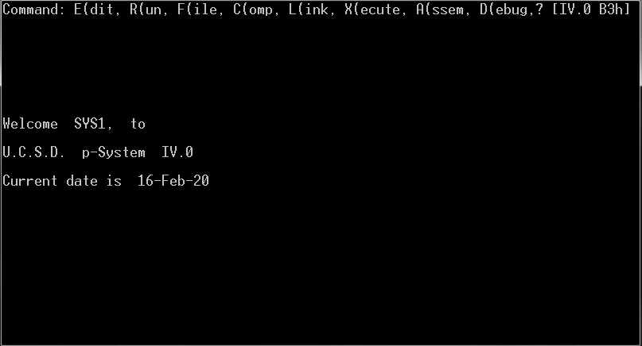
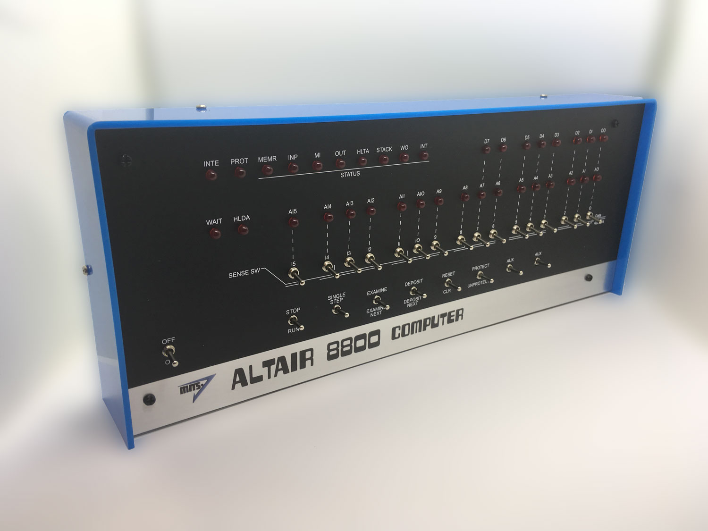

Altair8800_UCSDP
================

Port of UCSD p-System IV to Altair8800 Floppies
-----------------------------------------------

The goal of this project is to adapt an existing UCSD Pascal IV system to 8" Altair-format floppy 
disks so it can be booted from the standard CP/M bootloader ROM (CDBL on Altair-Duino).

The original UCSD Pascal IV system disk images come from the website of the Z80Pack emulator 
project: http://autometer.de/unix4fun/z80pack .

The project consists in:

### BOOT20CDBL:

The Primary Bootstrap, loading and starting the CP/M BIOS and the UCSD Secondary Bootstrap. 

The Primary Bootstrap is adapted from the AltairDuino CP/M Disk Boot Sectors 0 and 2 (Track 0) 
that are loaded by the CDBL ROM. Some code has beed added to move the UCSD Secondary Bootstrap to 
its effective location at 8200H, and to patch the CBIOS so CONOUT can correctly handle the ANSI 
Escape sequences by emitting a '\[' after the <ESC> character, as required by the UCSD specs for 
CBIOS.

Some additional code has beed added to initialize the stack before branching into the UCSD Secondary
Bootstrap. This code is loaded in Track 0 Sector 1 of the UCSD Boot Disk.

The CP/M BIOS is extracted as is from the AltairDuino CP/M DISK01.DSK disk image.

### AltairDisk:

This is a utility to convert the Altair disk images with interleaved 137-byte sectors to and from 
un-interleaved flat images of 128-byte sectors.

I use this tool to convert the original Altair-Duino disk image DISK01.DSK to a flat and 
un-interleaved format before extracting the boot sectors and the BIOS that I use later to generate 
the UCSD boot disk images.

### MakeDisk:

This is a utility to construct flat disk images from elements of various origins. This is the tool 
I use to assemble the target UCSD boot disk images from:
- the Primary Bootstrap in Track 0 Sectors 0-2, built from assembly language (BOOT20CDBL);
- the Secondary Bootstrap in Track 0 Sectors 3-18, extracted from the disk image 'ucsd-iv-sys1.dsk'
  that I found on the Z80Pack project's web site;
- the CP/M BIOS in Track 0 Sectors 20-31, extracted from the Altair-Duino CP/M 2.2 disk image 
  DISK01.DSK;
- the PASCAL contents in Tracks 1 and above, extracted from the disk image 'ucsd-iv-sys1.dsk', 
  tracks 1 to 76.

I use the same tool to build all other data disk images. It is also able to de-interleave and 
de-skew the data from the original UCSD disk images.

The build process:
------------------

1. Assemble the DISK20BOOT bootstrap module, using DISK20BOOT.asm, written in Z-80 assembly 
   language, using only the 8080A-compatible instructions, but easier to read and understand;
2. Convert the original Altair-Duino CP/M 137-byte sectors disk image DISK01.DSK to a flat image 
   128-byte sectors format DISK01.IMG, using the tool AltairDisk;
3. Create the UCSD-Pascal IV Boot Disk flat image DISK20.IMG from:
    - the primary bootstrap module from 1.;
    - the secondary bootstrap module from ucsd-iv-sys1.dsk, downloaded from the Z80Pack project 
      website;
    - the BIOS from the CP/M flat image converted in 2.;
    - the PASCAL tracks 1-76 from ucsd-iv-sys1.dsk;
4. Create the other UCSD-Pascal disk images DISK21.IMG to DISK28.IMG from the disk images obtained 
   from the Z80Pack project website;
5. Convert all flat disk image DISK20.IMG to DISK28.IMG to the Altair 137-byte sectors disk image 
   format DISK20.DSK to DISK28.DSK.

The generated disk images can then be copied to the Altair-Duino SD card. The DSKLIST.TXT text 
file containing the list of disk images needs to be adapted, to include the names of the new disk 
images.

Files:
------

- `DISK20BOOT.ASM`: source of the primary boot sectors I wrote from the reverse-engineered boot 
  sectors of the 63K CP/M 2.2mits disk image (DISK01.DSK from the Altair-Duino SD Card).
- `AltairDisk.c:` the tool I created to convert the Altair 137-byte sectors disk images to and from
  flat 128-byte sectors disk images, easier to manipulate.

Dedications:
------------

I dedicated my work to:
- _Udo Munk_, who did a great work writing his Z80Pack emulator and provided us with many useful
  UCSD Pascal resources, including p-System images running on his emulator and lots of documentation.
- _David Hansel_, who wrote and still maintains the Altair-8800 emulator software runnin in the
  Altair-Duino.
- _Chris Davis_, who designed and sells the remarquable Altair-Duino kits.
- _XXXXX_, who wrote the _Combo Disk Boot Loader_ (CDBL) module, which I reverse-engineered to
  understand how the Altair Disk System works.
